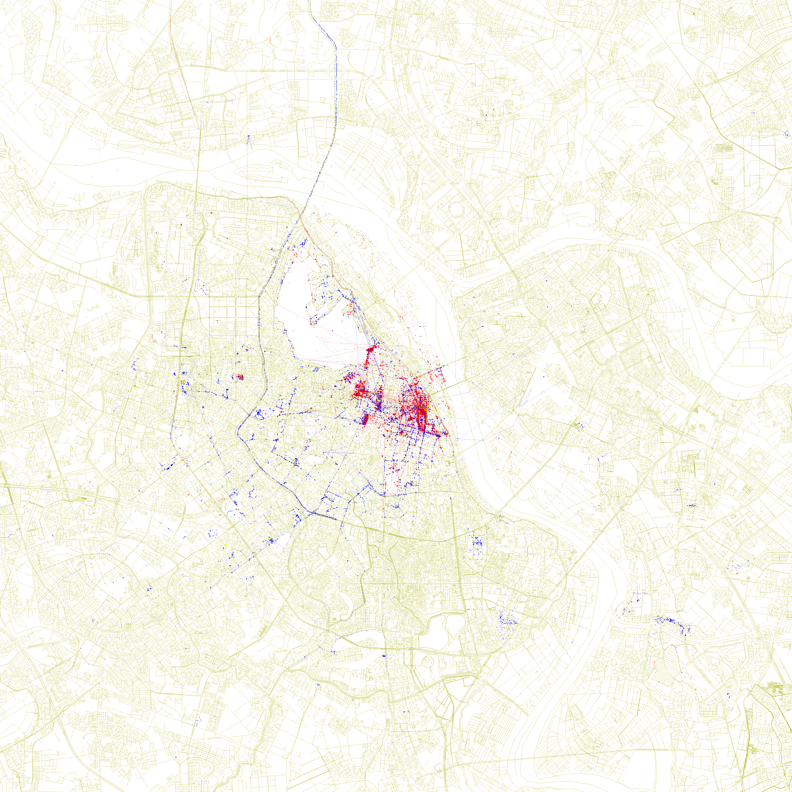

# Locals and Tourists: Hanoi

A reproduction of Erica Fischer's 2010 [*Locals and Tourists*](https://www.flickr.com/photos/walkingsf/albums/72157624209158632/)
map series, built for Hanoi. Fischer computed a bounding box for Hanoi but
never published its map.

    blue    locals    photographed in Hanoi over a span of a month or more
    red     tourists  a local of some other city, in Hanoi under a month
    yellow  unknown   photographed nowhere over a span of a month

*6137×6137 px at 3.95 m/px, the originals' canvas size. Smaller renders are in
[`out/`](out/).*

## Build

    .venv/bin/python lat/build_fischer.py --size 6137

## Result

| | photographers classified | with a mark on the map | photos plotted |
|---|---|---|---|
| locals (blue)    | 145 | 140 | 8,812 |
| tourists (red)   | 613 | 530 | 10,258 |
| unknown (yellow) | 202 | 147 | 1,204 |
| total            | 960 | 817 | 20,274, plus 2,524 connecting lines |

64% of photographers and 51% of plotted photographs are visitors. Blue spreads
about twice as wide as red: median distance from Hoàn Kiếm 2.48 km against
1.21 km. Red stays in the Old Quarter and around the lake.

## Data

The source is [YFCC100M](https://multimediacommons.wordpress.com/yfcc100m-core-dataset/),
the Creative Commons slice of the Flickr corpus Fischer worked from. It has the
four fields the method needs: photographer id, date taken, longitude, latitude.

    100,000,000 rows scanned       48,469,829 geotagged
    23,775 in a wide Hanoi box     23,631 kept after date cleaning
    960 photographers              1,106,583 rows of worldwide history

Date cleaning keeps 2003-01-01 to 2015-06-01. The raw data carries stamps from
1826 onward, and one bogus early date is enough to mislabel a photographer.

The worldwide history is what makes the colours possible. From Hanoi photos
alone, 812 of the 960 photographers would be unknown and 3 would be tourists.

## Classification (`lat/classify.py`)

Residency is tested inside 15-mile boxes, Δlat 0.217705° and Δlon scaled by
cos(lat), the shape Fischer used.

1. A photographer is a local if their photos inside the Hanoi box span 30 days
   or more.
2. Otherwise they are a tourist if some 15-mile box not overlapping Hanoi's
   holds photos of theirs spanning 30 days or more.
3. Otherwise they are unknown.

The box search is exhaustive, and `tests/test_classify.py` covers it.
[LIMITATIONS.md](LIMITATIONS.md) records the searches that were wrong first.

## Rendering (`lat/fischer.py`)

| | |
|---|---|
| canvas | 6137×6137, `#FFFFFF` |
| projection | cylindrical equirectangular |
| bounds | Fischer's own Hanoi box `20.926386 105.728233 21.144091 105.961466`, 24.23 km square |
| basemap | present-day OSM via Overpass, 1 px strokes, `#AAAA00`, no hierarchy, no fills |
| points | 3×3 px opaque squares, `#0000FF` / `#FF0000` / `#FFFF00` |
| lines | 1 px at alpha 0.55, accumulating where segments coincide, joining one photographer's consecutive photos within 10 min and 15,000 ft |
| downscales | box averaging |

Every value was measured on Fischer's London sheet, not assumed. Lines carry
63% of the data ink, so line alpha is the parameter that matters most.
[STYLE.md](STYLE.md) records each measurement and the wrong answers that
preceded it.

## Visual geolocation of bad geotags

18.4% of the kept rows carry Flickr geo accuracy below 12, meaning city-level
or worse. They pile onto place-picker pins rather than measured positions.

A vision pass reads the photographs and decides whether each shared pin is a
real place or a dumping ground, then relocates what is identifiable from street
plates, shop signs and plaques. Place names go through Nominatim; none are
asserted from memory. The protocol is `geoguessr-prompt.txt`.

    40 pin groups adjudicated       30 genuine places   10 dumping grounds
    675 photos examined             367 relocated to 49 coordinates
    1,351 photos on dumping grounds, not relocatable, masked from the map

Masked photos stay in the classification: a city-level geotag is still
evidence the photographer was in Hanoi.

## Layout

    lat/build_fischer.py    end-to-end build  <- entry point
    lat/harvest_yfcc.sh     one streaming pass over YFCC100M
    lat/build.py            loading, date cleaning, worldwide-history join
    lat/classify.py         locals / tourists / unknown
    lat/fischer.py          the 6137 px renderer
    lat/titled.py           the map with title and legend
    lat/geocode.py          Nominatim lookup with on-disk cache
    lat/apply_vision.py     vision answers -> coordinate overrides
    lat/multi.py            multi-source merge (see data/multi/MERGE.md)
    lat/build_multi.py      renders the merged map to out/multi/
    lat/density.py          squares sized by distinct photographers per cell
    lat/build_density.py    renders that variant to out/density/
    lat/harvest_*.py        per-source harvesters, including the excluded ones
    lat/nocoord_*.py        Commons files with no coordinate: sheets, vision, titles
    lat/build_placed.py     own-work filter; writes the commonsplaced source
    tests/                  run with PYTHONPATH=.
    tools/measure_style.py  reproduces the style measurements
    geoguessr-prompt.txt    the photo-geolocation protocol
    STYLE.md                the style spec, with evidence tiers
    LIMITATIONS.md          known gaps and superseded approaches

`out/stats.json` records the headline counts.

## Multi-source variant

[`data/multi/MERGE.md`](data/multi/MERGE.md) adds every other reachable source
of geotagged photographs. It renders to `out/multi/` and never touches the map
above.

    .venv/bin/python lat/build_multi.py --size 6137 --per-source

A source qualifies if it has a stable photographer id, a date, a coordinate,
and a queryable worldwide history. Wikimedia Commons and iNaturalist pass.
GBIF, Panoramax, Wikidata, OpenAerialMap, OSM notes, KartaView and OSV-5M
fail; MERGE.md records the measurement behind each.

The merged map holds 42,394 points from 2,607 photographers, against 20,274
from 817 above. The colour balance inverts, 59% local against 51% visitor. The
inversion is entirely Wikimedia Commons, whose points are 83.7% local, and much
of that is date coverage: restricting every source to the years YFCC covers
gives 50.6% local. Read it as a statement about Commons, not about Hanoi.

95 of the merged points are Commons files with no coordinate, placed by agents
naming the site from the image, GeoGuessr-style, or by geocoding the title.
They mark where the subject is, not the camera, snap to one centroid per site,
and never draw a travel line. A file is used only when its Artist credit is
the uploader. An adversarial audit failed the first version of this source and
MERGE.md records what changed.

### Busy places (`out/density/`)

Opaque 3×3 points draw a thousand photographs on one spot exactly as they draw
one; on the merged data 48.4% of photographs are hidden this way. This variant
lays a square under each 16 px cell, about 63 m, with side 3 × sqrt(n) for n
distinct photographers of that colour, capped at 41 px, none when n is 1.
Squares go down largest first and the points on top.

    .venv/bin/python lat/build_density.py merged --size 6137

The 50 largest squares hold between 17 and 142 photographers each. Sizing by
photographs was tried first; 44 of its 50 largest squares held one person.

## Privacy

Reddit, Instagram, TikTok and X were not crawled. None exposes a geotag the
photographer attached, and colouring their users would mean inferring home
cities from posting history, which is profiling. Every source here uses
location data the photographer attached to their own photograph.

## Limitations

See [LIMITATIONS.md](LIMITATIONS.md).

## Credits and licensing

Erica Fischer's work, which this reimplements:

- [*Locals and Tourists*](https://www.flickr.com/photos/walkingsf/albums/72157624209158632/),
  the map series
- [*Locals and Tourists #1 (GTWA #2): London*](https://www.flickr.com/photos/walkingsf/4671589629/),
  the sheet the style measurements were taken against
- [flickr.com/photos/walkingsf](https://www.flickr.com/photos/walkingsf/), where
  the series was published
- [github.com/e-n-f/bounds](https://github.com/e-n-f/bounds), the precomputed
  city boxes; `flickr-picasa/124` is Hanoi and is used verbatim
- [github.com/e-n-f/datamaps](https://github.com/e-n-f/datamaps), the
  point-rendering tool from the same body of work

The method and the look are Fischer's. This is a reimplementation, not an
original design.

Other sources:

- Photograph metadata from [YFCC100M](https://multimediacommons.wordpress.com/yfcc100m-core-dataset/).
  Photographs are © their photographers under their Creative Commons licences.
  This repository stores only metadata; thumbnails fetched for the vision
  passes were deleted after use.
- Basemap © OpenStreetMap contributors, ODbL, via the Overpass API.
- Geocoding by Nominatim / OpenStreetMap.
- `data/ref_london.jpg` is a downscale of Fischer's London sheet, © Erica
  Fischer, [CC BY-SA 2.0](https://creativecommons.org/licenses/by-sa/2.0/),
  kept as a measurement reference. The 6137×6137 original is not
  redistributed; fetch it from the [Flickr page](https://www.flickr.com/photos/walkingsf/4671589629/)
  to reproduce the figures that rely on it.
